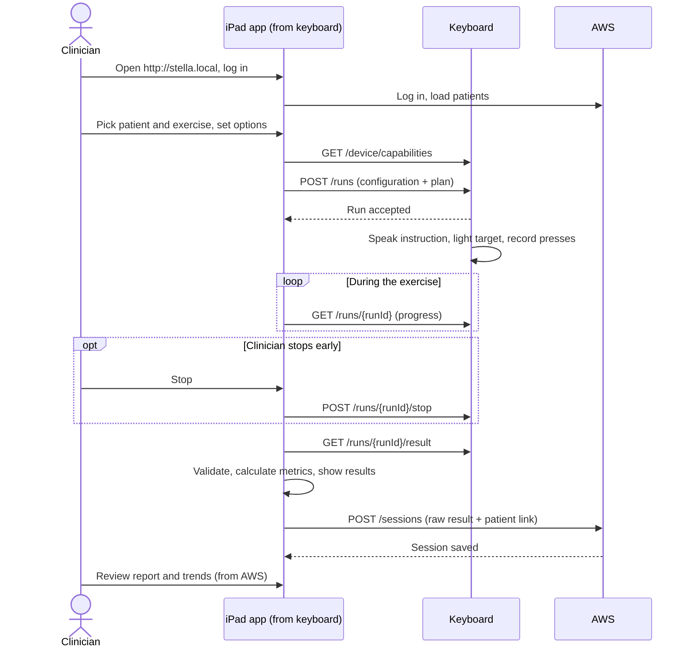
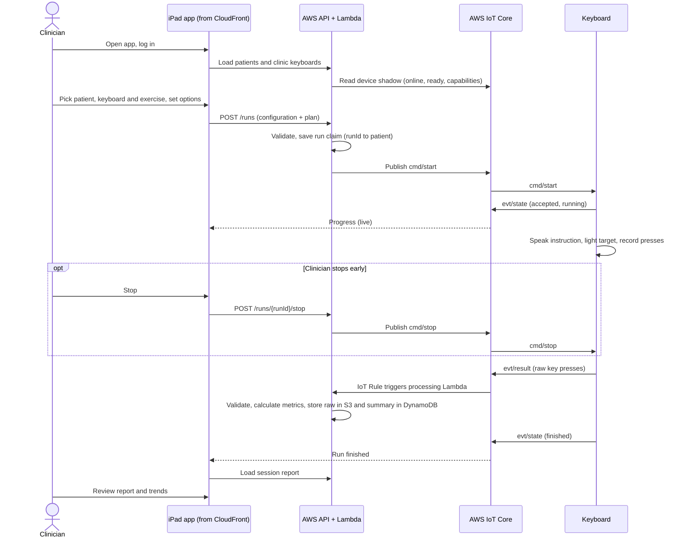

# Stella Keyboard Integration Options

Status: summary for discussion, 2026-10-09. Compares two ways to connect the clinician app to the Stella keyboard. Detailed requirements for the chosen direction are in [keyboard-integration-architecture.md](./keyboard-integration-architecture.md); the message and data contract shared by both options is in [exercise-integration-data-model.md](./exercise-integration-data-model.md).

Both options meet the same requirements:

- The app sends an exercise configuration to the keyboard.
- The app starts and stops exercises.
- The keyboard returns every key press with its timing, and Stella records, processes, and reports on it.
- Session data is stored in the cloud (AWS).

In both options the keyboard (a Raspberry Pi Pico W) measures all timing on its own clock, so network delay never changes the results. The difference is where the app lives and how it reaches the keyboard.

## Option 1: App hosted on the keyboard, data stored in the cloud

The keyboard serves the clinician app to the iPad over the clinic Wi-Fi. The iPad talks to the keyboard directly for exercises, and uploads finished sessions to AWS.

### Architecture

```
                          Clinic Wi-Fi (same network)
 ┌──────────────────────────────┐                ┌───────────────────────────────┐
 │  Stella keyboard (Pico W)    │  http://       │  iPad (Safari)                │
 │                              │  stella.local  │                               │
 │  - web server: app files     │ ◄────────────► │  - clinician app (loaded      │
 │    from microSD              │  app files +   │    from the keyboard)         │
 │  - local exercise API        │  exercise API  │  - processes results          │
 │  - displays, switches, audio │                │  - upload queue (IndexedDB)   │
 │  - timing on the chip        │                │                               │
 └──────────────────────────────┘                └───────────────┬───────────────┘
                                                                 │ HTTPS (internet)
                                                                 │ login, patients,
                                                                 │ session upload
                                                 ┌───────────────▼───────────────┐
                                                 │  AWS                          │
                                                 │  - Cognito (logins)           │
                                                 │  - API Gateway + Lambda       │
                                                 │  - DynamoDB (sessions)        │
                                                 │  - S3 (raw key-press data)    │
                                                 └───────────────────────────────┘
```

### Exercise flow



1. The clinician opens `http://stella.local` on the iPad; the keyboard serves the app.
2. The app logs in to AWS and loads the clinic's patients.
3. The clinician picks a patient and an exercise and sets the options.
4. The app sends the configuration to the keyboard and starts the run. No patient details go to the keyboard.
5. The keyboard runs the exercise and records every press. The app polls it for progress, and can send Stop.
6. When the run ends, the app fetches the raw result from the keyboard, calculates the metrics, and shows the results.
7. The app uploads the session to AWS. If the internet is down, it stays in the iPad's upload queue and retries.
8. Reports and trends are read from AWS.

### Strengths

- Exercise control works on the local network, so a run can start and finish while the internet is down (upload happens later).
- The Pico W needs no encryption (TLS) and no cloud certificates.
- Close to the existing contract: the HTTP operations in the integration model are used as written.

### Weaknesses and risks

- **Load on the Pico W:** it serves the app files (several hundred KB) as well as running displays, switches, and audio. First load is slow and the web server competes with exercise work for RAM.
- **Plain HTTP page:** Safari treats it as insecure. Some browser features are blocked, and the standard Cognito login page requires an HTTPS address, so login needs a workaround to be proven.
- **Same-network dependency:** the iPad must be on the same Wi-Fi as the keyboard, and the network must allow devices to see each other. Many clinic and guest networks block this. `stella.local` name lookup is unreliable on some networks.
- **Updates:** each keyboard holds its own copy of the app, so every release must reach every device.
- **Data relay:** session data reaches the cloud only if the iPad that ran it uploads it. Closing the browser or clearing Safari data before upload loses the queued session.
- **No fleet view:** the cloud cannot see whether a keyboard is online.

## Option 2: App and data in the cloud, keyboard connects via AWS IoT (MQTT)

The app is hosted in AWS. The keyboard keeps one outbound encrypted connection to AWS IoT Core. The app and keyboard never talk directly; commands and results pass through the cloud.

### Architecture

```
 ┌─────────────────────────┐                                ┌──────────────────────────────┐
 │  iPad (Safari)          │                                │  Stella keyboard (Pico W)    │
 │                         │                                │                              │
 │  - clinician app        │                                │  - MQTT client (TLS, 443)    │
 │    (loaded from         │                                │  - displays, switches, audio │
 │    CloudFront)          │                                │  - timing on the chip        │
 │                         │                                │  - results kept on microSD   │
 └────────────┬────────────┘                                └───────────────┬──────────────┘
              │ HTTPS: login, start/stop,                                   │ MQTT over TLS
              │ reports. WSS: live progress                                 │ (outbound only)
              │                                                             │
 ┌────────────▼─────────────────────────────────────────────────────────────▼──────────────┐
 │  AWS                                                                                     │
 │                                                                                          │
 │  CloudFront ── app files          Cognito ── logins                                      │
 │                                                                                          │
 │  API Gateway + Lambda ──── publish cmd/start, cmd/stop ────►  AWS IoT Core               │
 │     │  (auth, validate,                                         │  - device registry     │
 │     │   link run to patient)                                    │  - device shadow       │
 │     │                                                           │    (online, ready)     │
 │     │                              evt/state ◄──────────────────┤                        │
 │     │                              evt/result ──► IoT Rule ──► Lambda (process)          │
 │     ▼                                                              │                     │
 │  DynamoDB (sessions, run claims) ◄─────────────────────────────────┤                     │
 │  S3 (raw key-press data)         ◄─────────────────────────────────┘                     │
 └──────────────────────────────────────────────────────────────────────────────────────────┘
```

### Exercise flow



1. The clinician opens the Stella web address on the iPad and logs in.
2. The app shows the clinic's patients and its keyboards that are online and ready.
3. The clinician picks a patient, a keyboard, and an exercise, and sets the options.
4. The app asks the API to start. The API checks the request, records which patient the run belongs to, and sends the start command to the keyboard through IoT Core. No patient details go to the keyboard.
5. The keyboard runs the exercise and records every press. It sends progress updates, which the app shows live. Stop goes through the same path as Start.
6. When the run ends, the keyboard sends the raw result to IoT Core. A cloud function checks it, calculates the metrics, and saves the session.
7. The app shows the results and trends from AWS.
8. If the internet drops during a run, the keyboard finishes it, keeps the result on its memory card, and sends it when the connection returns.

### Strengths

- **No browser restrictions:** everything the iPad uses is HTTPS from AWS.
- **Light on the Pico W:** one outbound connection, no web server.
- **Works on more clinic networks:** only outbound internet is needed; devices do not have to see each other and no local name lookup is needed.
- **One deployment:** the app is updated once in the cloud. Keyboard firmware can also be updated over the air.
- **Data goes straight to the cloud:** the keyboard uploads results itself, so nothing depends on the iPad staying open.
- **Fleet view:** the cloud knows which keyboards are online, ready, and on which firmware version.

### Weaknesses and risks

- **Internet required to start a run.** A run already in progress finishes and uploads later.
- **Encryption on the Pico W:** TLS plus MQTT uses a large share of its RAM (roughly 40-60 KB). This must be proven on the 4-button rig first.
- **Device setup:** each keyboard needs its own certificate at manufacture, a Wi-Fi setup step, and pairing to a clinic (see section 7 of the architecture doc).
- **More AWS pieces:** IoT Core, device policies, rules, and a claim-code flow.

## Sound: keyboard speaker or iPad

Several exercises play a voice prompt, a metronome, or music, and the rhythm metrics (`beatTimestamp`, `onBeatAccuracyPercent`, `timingVariabilityStdDev` in [exercise-data-model.md](./exercise-data-model.md)) compare each key press with the nearest beat. Press times come from the keyboard's clock, so beat times must come from the same clock.

- **Sound on the iPad, Option 2:** beats and presses are on two clocks separated by a variable cloud round trip. The rhythm metrics would not be valid.
- **Sound on the iPad, Option 1:** the gap is smaller (local Wi-Fi), but iPad audio output delay and Wi-Fi jitter still add tens of milliseconds, which is too much for an on-beat window.
- **Sound on the keyboard (either option):** beats and presses share one clock, and network delay stays out of the results.

Decision: timing-critical sound (voice prompts, metronome, music) plays from a speaker in the keyboard. The iPad may still play sound that is not timing-critical, such as UI feedback or previewing a track.

What this adds, in either option:

- **Hardware:** the Pico W has no audio output. It needs an I2S amplifier board (for example MAX98357A) and a speaker, which takes 3 GPIO pins. All GPIO is currently assigned, so pins must be freed.
- **Audio files:** the app's MP3s (the music track alone is about 370 KB) are converted at build time to WAV or ADPCM on the microSD card, so the Pico W does not decode MP3. The metronome click is generated on the device.
- **Music speed:** changing `musicPlaybackRate` without changing pitch is too costly for the Pico W. Ship pre-rendered versions at a few fixed speeds, or accept the pitch change.
- **Load on the Pico W:** audio playback shares a core with button scanning and displays, and shares the microSD card with result writes. Press-timing jitter must be measured with audio playing.
- **Contract:** the start command carries audio mode, tempo, clip IDs, and beat map; the result carries beat timestamps on the keyboard's clock.
- **Content updates:** new or changed sounds must reach every keyboard. Option 2 can deliver them over the air; Option 1 has no fleet channel for this.

## Side-by-side

| | Option 1: app on keyboard | Option 2: cloud + IoT (MQTT) |
|---|---|---|
| Where the app is loaded from | Keyboard (`http://stella.local`) | AWS CloudFront (HTTPS) |
| How app and keyboard talk | Directly, local Wi-Fi | Through AWS IoT Core |
| Start a run with no internet | Yes | No |
| Session reaches the cloud | When the iPad uploads it | Keyboard sends it directly |
| iPad and keyboard on same network | Required, devices must see each other | Not required |
| Browser security issues | Plain HTTP page; login workaround needed | None |
| Work on the Pico W | Web server + app files + exercise API | MQTT client with TLS |
| App updates | Every keyboard | Once, in the cloud |
| Device online status | Not visible to the cloud | Built in |
| Device setup | Wi-Fi only | Wi-Fi, certificate, clinic pairing |
| Where sound plays | Keyboard speaker | Keyboard speaker |
| Sound content updates | Every keyboard, by hand | Over the air |
| Biggest risk | Pico W serving the app; clinic networks blocking local traffic | TLS and audio fitting in Pico W RAM and CPU |

## Recommendation

Option 2. Session data must end up in the cloud anyway, so Stella already needs internet, which removes Option 1's main advantage. Option 2 avoids the iPad browser and clinic network problems and asks less of the Pico W. Its main risk, TLS on the Pico W, can be tested on the existing 4-button rig before more firmware is written (see section 9 of the architecture doc).

Moving sound to a keyboard speaker does not change this recommendation. Both options need it, because rhythm metrics require beats and presses on the same clock. It strengthens Option 2: with the keyboard owning all timing, including sound, cloud latency never affects results, and sound content can be updated over the air. The spike must now also prove that audio playback and TLS fit together on the Pico W without adding press-timing jitter.
